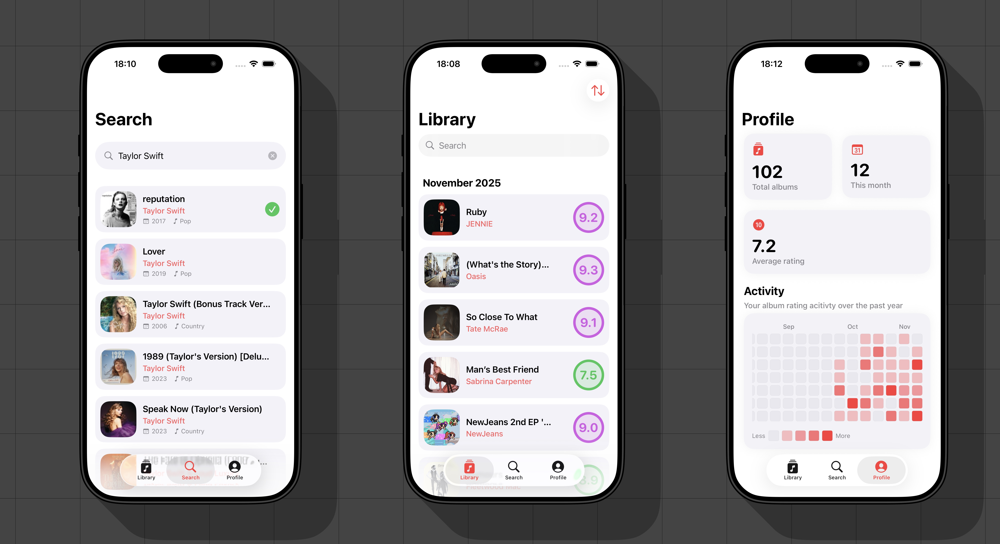

# RateYourAlbums

RateYourAlbums is an open-source application for rating music albums. It's built entirely in SwiftUI

## Why?

I don't find it very convenient to use platforms like Albums of the Year or RateYourMusic, which are essentially web applications. Every single time I want to rate an album, I have to open a browser and deal with a slow, clunky interface, wasting a lot of time. This app primarily solves my own problem with rating and tracking the albums I have listened to, but I'm sure it will be useful to someone else as well!
